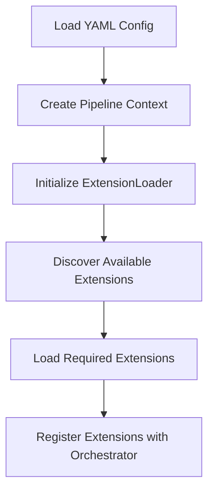
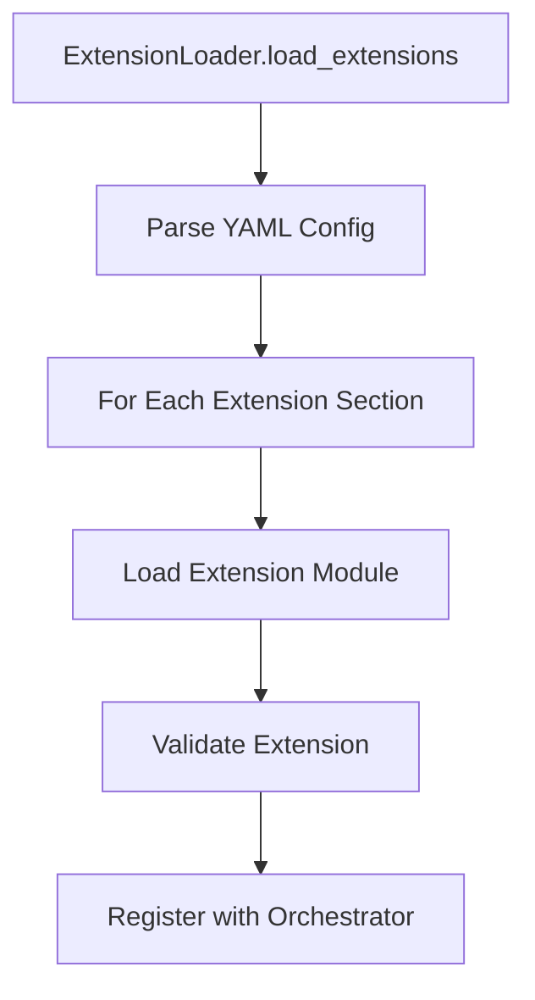
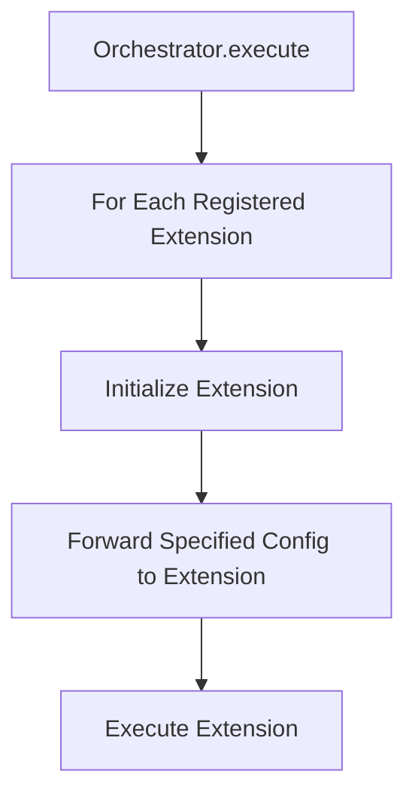
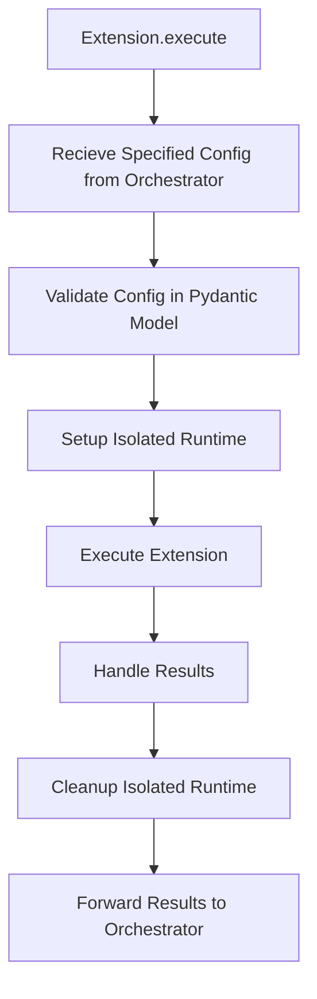
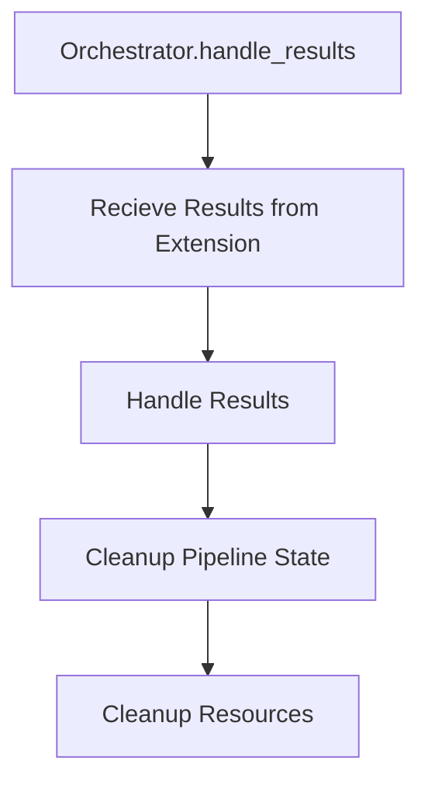
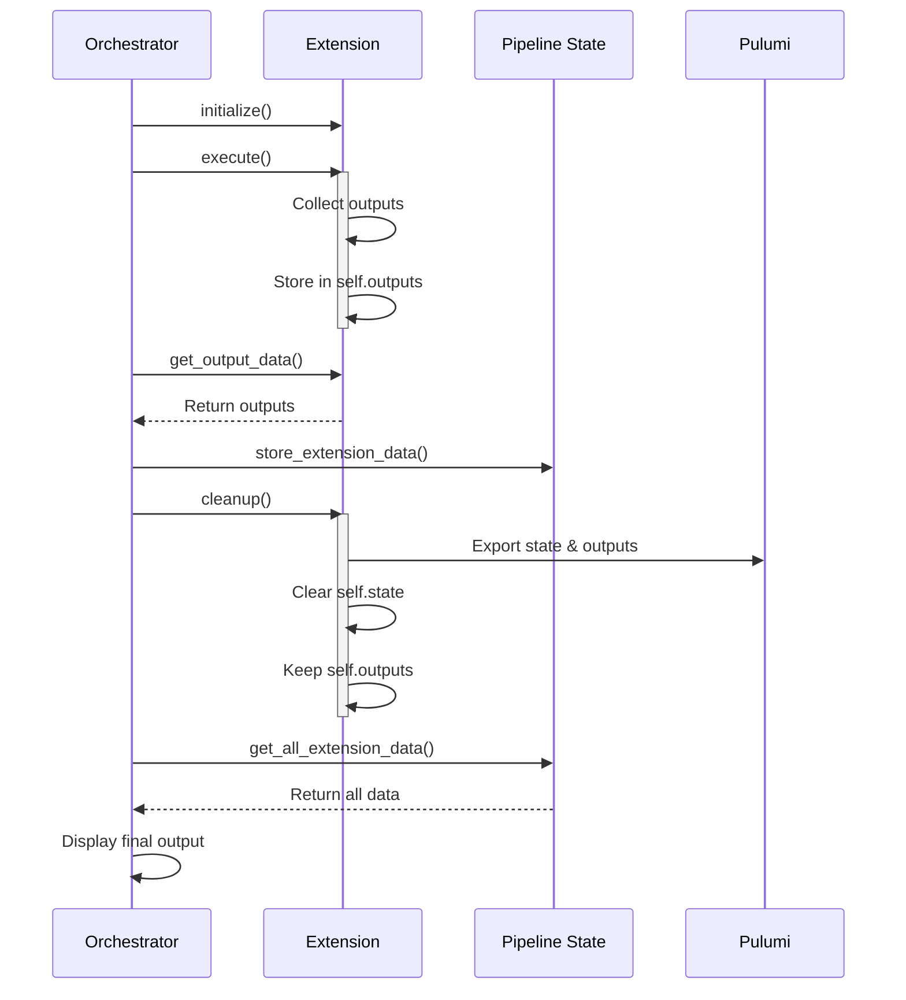
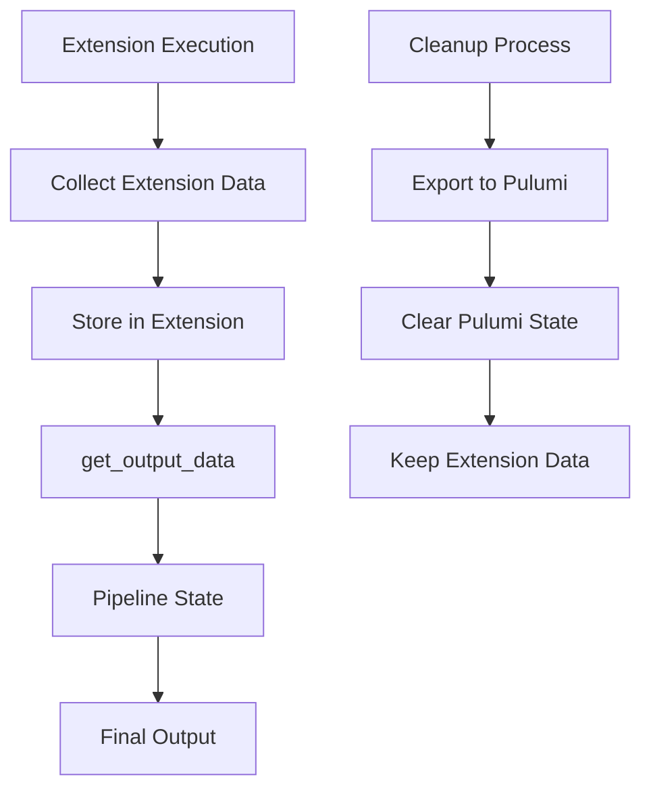

# Pipeline Orchestrator Architecture

## Pipeline Orchestrator

- Pipeline Orchestrator is a tool that allows you to orchestrate your infrastructure through a single yaml file.

## Core Design Principles

### 1. Separation of Concerns
- Interaction with the Pulumi SDK will happen though a well defined interface to be able to switch to other tools in the future
- Each component has a single, well-defined responsibility
- Clear boundaries between pipeline core and individual extensions
- Extensions operate in isolation from each other
- Core orchestrator manages global state and coordination

### 2. Strict Interface Separation
- Your main Python code should never directly use Pulumi SDK
- All Pulumi interactions should go through a dedicated interface/abstraction layer
- This creates a clear boundary between your business logic and infrastructure management

### 3. Infrastructure Provider Agnostic
- By using an interface, you're making your code independent of Pulumi
- Tomorrow, if you want to switch from Pulumi to Terraform, AWS CDK, or any other IaC tool, you only need to create a new implementation of the interface
- Your main application code wouldn't need to change at all

### 4. Single Responsibility
- The interface handles all infrastructure-related operations
- Your business logic remains clean and focused on its core purpose
- Infrastructure concerns are isolated and encapsulated

### 5. Information Isolation
- Extensions only receive configuration they need
- No access to global pipeline state from Extensions
- Core pipeline configuration stays within orchestrator
- Extensions validate their own configuration and handle their own pydantic models

### 6. Modularity
- Each extension is a standalone module
- Extensions can be easily replaced or extended
- New extensions can be added without modifying existing ones
- Each extension will be run as a separate pulumi stack where the extension name is appended to the stack name

### 7. Extensibility
- New extensions can be added without modifying the core orchestrator project
- New extensions can be added without modifying the core pydantic models
- Extensions are designed to be distributed as pip-installable packages
- Extensions can be mixed and matched freely within pipeline runs

### 8. Shared Utilities
- Common helper methods and utilities live in the core pipeline
- Core utilities are available for use across all extensions
- Extensions must not implement their own versions of core utilities interfaces
- Core utilities handle common tasks like file downloads, git operations, and HTTP requests

### 9. Cross-Dependency Rules
- Extensions must maintain strict isolation from each other
- No direct dependencies between extensions are allowed
- All shared functionality must go through the core pipeline
- Extensions can only depend on the core pipeline interfaces

## Core Responsibilities
- Read the yaml file
- Setup the core pydantic models
- Register the pulumi stacks that the yaml file contains
- Run the pulumi stacks

### 1. Extension System

#### Extension Loader (`core/loader.py`)
- Dynamically discovers and loads extension modules
- Validates extension compatibility
- Manages extension dependencies
- Provides extension registry functionality
- Ensures isolation between extensions

```python
ExtensionLoader
├── discover_extensions()    # Find available extensions
├── load_extension()        # Load single extension
├── load_extensions()       # Load multiple extensions
```

#### Extension Handler (`handlers/extension.py`)
- Base interface for all extensions
- Defines standard lifecycle methods
- Manages container operations
- Handles extension-specific validation
- Maintains isolated state and resources

```python
ExtensionHandler
├── initialize()           # Setup extension instance
└── execute()             # Run extension logic
```

### 2. Orchestration Layer (`core/orchestrator.py`)
- Manages pipelines execution flow
- Handles extensions registration and lifecycle
- Coordinates between extensions
- Maintains pipelines state
- Controls information flow between components

```python
Orchestrator
├── register_extension()   # Add extension to pipeline
├── initialize()          # Setup pipeline
├── execute()             # Run pipeline
└── cleanup()             # Cleanup resources
```

## Component Responsibilities

### 1. Core Pipeline
Responsibilities:
- Loading and validating complete configuration
- Managing global pipeline state
- Configuration distribution
- Create and manage pulumi stacks
- Coordinating extension execution in pulumi stacks
- Handling pipeline-wide resources

### 3. Extensions
Responsibilities:
- Implementing specific functionality
- Managing own isolated runtime, virtual environment, containers, etc.
- Handling extension-specific state
- Self-contained cleanup

Access Level:
- Only receives own configuration
- No access to other extensions
- No access to pipeline internals
- Limited to own resource scope

## Execution Flow

### 1. Pipeline Initialization


### 2. Extension Loading Process


### 3. Extension Execution Flow


### 4. Extension Execution


### 5. Orchestrator Handling Results and Cleanup


### 5. State and Output Sequence


## Configuration Hierarchy

### 1. Pipeline Level (Orchestrator Only)
```yaml
pipeline_config_name:
  core: #Core Config/Global Vars
    execution_defaults:
      max_attempts: 3
    ...
  example: #Extension Name
    - name: example-1
      ...
  terraform: #Extension Name
    - name: terraform-dev
      ...
```

### 2. Extension Level (What Extensions See)
```yaml
name: terraform #Extension Type, used to determine which extension to load
#Extension Specific Vars
```

## Implementation Guidelines

### 1. Extension Packaging
- Extensions must be packaged as standalone Python packages
- Each extension must include a complete pyproject.toml with all dependencies
- Extensions must specify their minimum core pipeline version compatibility
- Extensions should follow the standard structure:
  ```
  extension_name/
  ├── README.md
  ├── pyproject.toml
  ├── __init__.py
  ├── models.py
  ├── bootstrap.py
  └── extension.py
  ```

### 2. Extension Registration
- Extensions must be registered before initialization
- Establishes extension order and dependencies
- Maintains isolation between extensions

### 3. Extension Initialization
- Occurs after registration
- Identifies parallel extensions
- Identifies sequential extensions
- Identifies dependencies between extensions

### 4. Extension Execution
- Follows defined order in pipeline
- Handles dependencies between extensions
- Manages state between extensions
- Provides error handling and retry logic
- Maintains execution isolation

### 5. Extension Cleanup
- Occurs after execution
- Cleans up extension-specific resources
- Ensures no residual state
- Maintains isolation between extensions

## State Management

### 1. Core Pipeline State
- Tracks overall pipeline progress
- Maintains extension status
- Handles overall parallel and sequential execution
- Handles cross-extension data
- Controlled by orchestrator only

### 2. Extension State
- Manages extension-specific data
- Tracks Isolated runtime state
- Handles runtime parallel and sequential execution
- Handles extension results
- Isolated from other extensions

## Error Handling

### 1. Pipeline Level
- Manages overall pipeline failures
- Coordinates recovery strategies
- Handles cleanup on failure
- Maintains error isolation

### 2. Extension Level
- Handles extension-specific errors
- Implements retry logic
- Manages resource cleanup
- Contains error scope

## Extension Interface

### 1. Provided to Extensions
```python
def __init__(self, 
    name: str,                         # Extension instance name
    config: Dict[str, Any],            # Extension-specific config only (merged with pipeline defaults)
    stack: str                        # Pulumi stack name
)
```
### 2. Not Provided to Extensions
- Pipeline configuration
- Other extension details
- Global pipeline state
- Cross-extension data

## Future Considerations

### 1. Extension Marketplace
- Standard format for extensions
- Version management
- Dependency resolution
- Isolation guarantees

### 2. Pipeline Templates
- Reusable pipeline configurations
- Best practice templates
- Industry-specific workflows
- Configuration isolation patterns

### 3. Monitoring and Metrics
- Pipeline performance tracking
- Extension metrics
- Resource usage monitoring
- Isolation verification


## Structure

- Below is the base structure of the pipeline, it is the core of the pipeline and the main configuration for the pipeline

```
# The pipeline_orchestrator folder contains the core of the pipeline orchestrator pipeline
# It is the entry point for the pipeline
# Extensions can be used to add new functionality to the pipeline

pipeline_orchestrator/
├── __main__.py          # Entry point for running the pipeline
├── core/
│   ├── context.py       # Context management
│   ├── bootstrap.py     # Loads the pipeline configuration
│   ├── loader.py        # Extension loading
│   ├── logging.py       # Logging management
│   ├── orchestrator.py  # Pipeline orchestration
│   └── state.py         # State management
├── models/
│   └── pipeline.py      # Base configuration models
├── handlers/
│   └── extension.py     # Extension handler interface for all extensions
├── interfaces/
│   └── pulumi.py        # Pulumi interface to the pulumi sdk

# The extensions folder may be located here, but the idea is that the extenssions can be installed with pip and will be available in the pipeline
# The extensions are self contained and can be used as a independent extension
# Each extension has a bootstrap.py file that contains the necessary configuration for bootstrapping the extension
# Each extension has an extension.py file that contains the logic for the extension
# Each extension has a models.py file that contains the pydantic models for the extension
# Each extension has an __init__.py file that contains the initialization for the extension
# Each extension has a README.md file that contains the documentation for the extension
# Each extension has a pyproject.toml file that contains the dependencies for the extension and the astral uv build system

# Example 
terraform/
├── README.md
├── pyproject.toml
├── __init__.py
├── models.py
├── bootstrap.py
└── extension.py

# Example structure of multiple extensions in the extensions folder
extensions/
├── terraform/
│   ├── README.md
│   ├── pyproject.toml
│   ├── __init__.py
│   ├── models.py
│   ├── bootstrap.py
│   └── extension.py
├── ansible/
│   ├── README.md
│   ├── pyproject.toml
│   ├── __init__.py
│   ├── models.py
│   ├── bootstrap.py
│   └── extension.py
├── helm/
│   ├── README.md
│   ├── pyproject.toml
│   ├── __init__.py
│   ├── models.py
│   ├── bootstrap.py
│   └── extension.py
├── kubectl/
│   ├── README.md
│   ├── pyproject.toml
│   ├── __init__.py
│   ├── models.py
│   ├── bootstrap.py
│   └── extension.py
└── secrets/
    ├── README.md
    ├── pyproject.toml
    ├── __init__.py
    ├── models.py
    ├── bootstrap.py
    └── extension.py

## State and Output Management

### 1. Extension State Types
- **Pulumi State (`self.state`)**
  - Managed by base `ExtensionHandler`
  - Used for infrastructure state
  - Cleared during cleanup
  - Exported to Pulumi during cleanup

- **Extension Data (`self.outputs`, etc.)**
  - Extension-specific operational data
  - Persists throughout pipeline execution
  - Collected via `get_output_data()`
  - Used for pipeline output
  - Not cleared during cleanup

### 2. Data Flow


### 3. State Management Responsibilities

#### Extension Handler
- Manages Pipeline infrastructure state
- Provides base cleanup functionality
- Exports state to Pulumi
- Maintains state isolation

#### Individual Extensions
- Collect operational data
- Implement `get_output_data()`
- Preserve extension-specific data
- Handle extension cleanup

#### Pipeline Orchestrator
- Coordinates state collection
- Manages global pipeline state
- Handles final output assembly
- Maintains state isolation

### 4. Output Collection Process
1. Extension executes operations
2. Extension stores operational data
3. Orchestrator calls `get_output_data()`
4. Data stored in pipeline state
5. Cleanup preserves operational data
6. Final output includes all extension data
